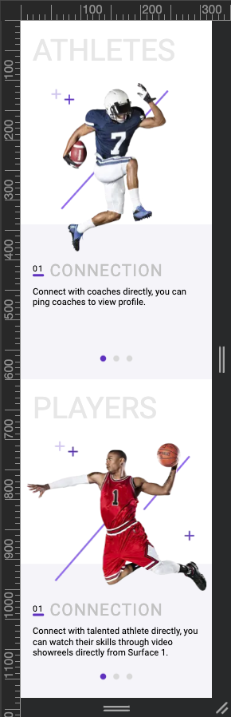

This is a [Next.js](https://nextjs.org/) project bootstrapped with [`create-next-app`](https://github.com/vercel/next.js/tree/canary/packages/create-next-app).

# Dependency
Node version 18.17.1
Yarn version 4.1.0

run the development server:

```bash
yarn add
yarn dev
```

Open [http://localhost:3000](http://localhost:3000) with your browser to see the result.

# Objective

- Create web application according to the following design for 3 screen sizes (1920 px,768 px,320 px)
- Swipeable content on mobile devices.
<br>

Screen size bigger than 1920px

<figure>
<!--   <figcaption>screen size bigger than 1920px</figcaption> -->
  
</figure>
<br>

Desktop screen size 1920px

<figure>
<!--   <figcaption>desktop screen size 1920px</figcaption> -->
  
</figure>
<br>

Tablet screen size 768px

<figure>
<!--   <figcaption>desktop screen size 768px</figcaption> -->
  
</figure>
<br>

Mobile screen size 320px
<figure>
<!--   <figcaption>mobile screen size 320px</figcaption> -->
  
</figure>
